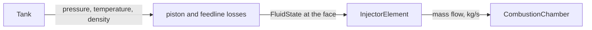
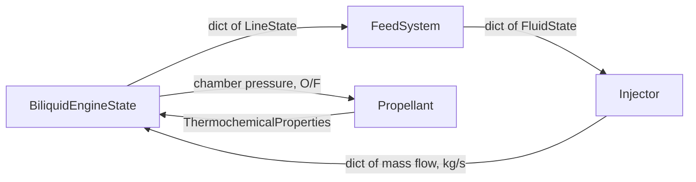

# 4. Feed Systems

A **feed system** is everything that stands between a propellant tank and the injector face.
Machwave models it as a set of **propellant lines**, one per propellant, each identified by name.
The propellant count is not part of the abstraction: one line feeds a hybrid motor or a monoliquid engine, two feed a biliquid engine, three feed a triliquid.

## 4.1 The propellant line

A [`PropellantLine`][machwave.models.feed_systems.lines.PropellantLine] carries three things: the **line name** that keys it everywhere else, the **role** it plays in combustion, and the [`Tank`][machwave.models.feed_systems.tank.Tank] it draws from.

The role reuses [`ComponentRole`][machwave.models.propellants.components.ComponentRole], the same enum a propellant formulation uses for its chemical components: `OXIDIZER`, `FUEL`, or `ADDITIVE`.
An additive line is a triliquid diluent or a coolant — something that flows, and is accounted for, without being either half of the mixture ratio.

The name is what ties the model together.
The feed system keys its lines by it, the injector keys its elements by it, and every series the simulation records is keyed by it.
Nothing in the loop asks "which side is this?"; it asks "which line?".

## 4.2 The injector face is the seam

The feed system owns everything upstream of the injector face — tank state, feedline pressure drop, the piston in a stacked-tank cycle, and later a pump discharge or a regenerative jacket pickup.
The injector owns the orifice.

What passes between them is a [`FluidState`][machwave.common.fluid_state.FluidState]: fluid name, pressure, temperature and density at the face.
That is the whole contract, so neither package imports the other and the injector never sees a tank.

## 4.3 Every line is solved in one call

[`FeedSystem.get_inlet_states`][machwave.models.feed_systems.base.FeedSystem.get_inlet_states] takes the state of **every** line and returns the inlet state of every line.
A concrete cycle implements only [`get_inlet_pressures`][machwave.models.feed_systems.base.FeedSystem.get_inlet_pressures]; the base class assembles the fluid states from the tanks around it.

Solving the lines together is what the physics asks for.
In a stacked-tank cycle the fuel is pressurized by the oxidizer ullage through a piston, so the fuel inlet pressure is a function of the *oxidizer* state.
Asking each line separately would mean passing every other line's state in as an argument, which grows with the square of the propellant count.

The state each line contributes is a [`LineState`][machwave.models.feed_systems.lines.LineState]: the fluid mass, and the internal energy for a tank running an energy balance.
These are exactly the variables the integrator carries between timesteps.

## 4.4 Pressure-fed cycles

### Stacked tanks

In [`StackedTankPressureFedFeedSystem`][machwave.models.feed_systems.cycles.stacked_tank_pressure_fed.StackedTankPressureFedFeedSystem] the tanks sit in a vertical stack.
The tank at the top — the **pressurizing line** — sets the pressure the whole system runs on, and drives every tank below it through a piston.

For a line $i$:

$$
P_{\text{inlet},i} = P_{\text{tank},p} - \delta_{i \neq p}\, \Delta P_{\text{piston}} - \Delta P_{\text{line},i}
$$

where:

- $P_{\text{tank},p}$ is the pressure of the pressurizing line's tank [Pa]
- $\Delta P_{\text{piston}}$ is the pressure loss across the piston [Pa], taken by every line below the top of the stack
- $\Delta P_{\text{line},i}$ is the pressure loss along that line's feedline [Pa]

Feedline loss is **stated for the design flow**, not computed from the instantaneous flow and the line geometry.

### A single line

[`SingleLinePressureFedFeedSystem`][machwave.models.feed_systems.cycles.single_line_pressure_fed.SingleLinePressureFedFeedSystem] is the one-line case:

$$
P_\text{inlet} = P_\text{tank} - \Delta P_\text{line}
$$

The tank pressurizes itself.
A self-pressurized propellant such as nitrous oxide rides its own vapor pressure while liquid remains, then blows down on the real-gas equation of state once none does — both handled by [`Tank.get_pressure`][machwave.models.feed_systems.tank.Tank.get_pressure].
An empty tank returns zero pressure, which stops the flow at the injector element.

This is the shape an oxidizer-only hybrid feed and a monoliquid engine both take.

## 4.5 The orifice

An [`InjectorElement`][machwave.models.thrust_chamber.injector.InjectorElement] is a discharge coefficient, a flow area, and a choice of mass flow model.
It is a pure function of its own inlet, and returns no flow once the chamber has caught up with that inlet — there is no backflow model.

**SPI**, the single-phase incompressible orifice equation, for a subcooled liquid:

$$
\dot{m} = C_d\, A\, \sqrt{2 \rho \left(P_\text{inlet} - P_0\right)}
$$

**HEM**, the homogeneous-equilibrium model, for a self-pressurized propellant whose upstream liquid flashes across the orifice and can choke on the two-phase sound speed:

$$
\dot{m} = C_d\, A\, G_\text{HEM}
$$

An [`Injector`][machwave.models.thrust_chamber.injector.Injector] holds one element per line name, and [`get_mass_flows`][machwave.models.thrust_chamber.injector.Injector.get_mass_flows] answers with the flow of every line at a given chamber pressure.

## 4.6 What the loop does with it

Each timestep, [`BiliquidEngineState.run_timestep`][machwave.simulation.biliquid.states.BiliquidEngineState.run_timestep] reads every inlet state once, then calls the injector at each chamber pressure the RK4 solver tries.
No line is allowed to deliver more than the mass it has left over the timestep.

The **mixture ratio** is the total oxidizer flow over the total fuel flow, taken by line role:

$$
\text{O/F} = \frac{\sum_{i \in \text{oxidizer}} \dot{m}_i}{\sum_{j \in \text{fuel}} \dot{m}_j}
$$

Summing by role rather than dividing one line by another is what keeps the definition honest at any propellant count.
An additive line stays out of it.
A monoliquid has no oxidizer total, so it has no mixture ratio at all, and the propellant is evaluated at its own formulation instead.

A tank running an **energy balance** carries its internal energy as a second state variable.
Draining takes out the enthalpy of what left:

$$
U_{n+1} = U_n - \Delta m\, h_\text{out}
$$

The fluid left behind boils to refill the ullage and cools doing it, which walks the saturation pressure down over the burn instead of holding it flat until the liquid runs out.
See [`Tank`][machwave.models.feed_systems.tank.Tank] for the thermodynamics.

## 4.7 Propellant count

| Lines | Engine | Cycle |
| --- | --- | --- |
| 1 | Hybrid motor (oxidizer only), monoliquid engine | `SingleLinePressureFedFeedSystem` |
| 2 | Biliquid engine | `StackedTankPressureFedFeedSystem.from_oxidizer_and_fuel` |
| 3 | Triliquid engine, with a diluent or coolant line | `StackedTankPressureFedFeedSystem` |

The feed system, the injector and the recorded results hold at every count.
Evaluating the *thermochemistry* of a three-propellant mixture is a separate matter: the thermochemical service is built around one oxidizer card and one fuel card, so a third stream has to be blended into one of them with a weight split before CEA can see it.

## References

- Sutton, G. P. & Biblarz, O., *Rocket Propulsion Elements*, 9th ed., Wiley, 2017. Sections 6.3 and 10.2.
- Whitmore, S. A. & Chandler, S. N., "Engineering Model for Self-Pressurizing Saturated-N2O-Propellant Feed Systems", *Journal of Propulsion and Power*, Vol. 26, No. 4, 2010.
