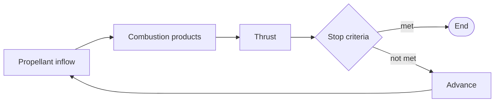

# Simulation Loop

Machwave's simulation loop takes a motor model plus a set of simulation parameters, iterates the motor state over time in fixed timesteps, and returns the time history of the run.

Implemented in [`InternalBallisticsSimulation`][machwave.simulation.base.InternalBallisticsSimulation].

## Inputs

The **[`Motor`][machwave.models.motors.Motor] model** is the physical description of the motor/engine: propellant, grain, feed system, thrust chamber, and more.
By design, it does not change during a run and no simulation state is stored in it.

The **simulation parameters** ([`InternalBallisticsSimulationParams`][machwave.simulation.base.InternalBallisticsSimulationParams]) set the conditions of the run:

- **Timestep:** the fixed interval between two evaluations of the motor.
- **Igniter pressure:** the chamber pressure at the start of the run.
  The ignition transient is not modeled, so the run starts with the chamber already pressurized.
  It must be high enough to choke the nozzle, otherwise the run ends on its first timestep, see [Stop Criteria](#stop-criteria).
- **External pressure:** the ambient pressure, held constant for the whole run.
  The trajectory is not modeled, so altitude changes during the burn are not accounted for; coupling to a flight is one-way, through the [RocketPy adapter](../api/adapters/rocketpy.md).

## Timestep Iteration

The **motor state** is what changes during a run: the time, the chamber pressure and the propellant left.
A solid motor tracks its propellant through the web distance the grain has burnt, a biliquid engine through the fluid mass left in each propellant line.

Implemented in [`SolidMotorState`][machwave.simulation.solid.states.SolidMotorState] and [`BiliquidEngineState`][machwave.simulation.biliquid.states.BiliquidEngineState], which the simulation picks from the motor type.
Both build on [`MotorState`][machwave.simulation.states.MotorState]: the base class holds the thrust calculation, the stop criteria and the history of every timestep, and each subclass supplies its propellant inflow and state variables.

Every timestep evaluates the motor at the current state, records the operating point in the history, and only then advances the state.
Both categories follow the same sequence and differ only in how propellant reaches the chamber:

1. **Propellant inflow.** The mass flow entering the chamber at the current chamber pressure.
   In a solid motor, the grain burns at the rate set by the chamber pressure (Saint Robert's law) over the burn area exposed at the current web distance, see [Grain Regression](grain_regression.md).
   In a biliquid engine, the feed system delivers each propellant to the injector, which sets the mass flow of each line from the pressure drop to the chamber.
   Both are derived in [Mass Balance](mass_balance.md).
2. **Combustion products.** The propellant's thermochemical properties are evaluated at the chamber pressure, and in a biliquid engine also at the mixture ratio set by the injector flows.
   This gives the flame temperature, gas constant and isentropic exponents of the combustion products.
3. **Thrust.** The ideal thrust coefficient follows from the chamber and external pressures, accounting for flow separation.
   The nozzle losses derate it, and the thrust follows, see [Thrust and Performance](thrust.md).
   The loss model receives the operating point as a frozen [`TimestepConditions`][machwave.simulation.states.TimestepConditions] snapshot: it can read every quantity of the timestep but cannot change the state.
4. **Stop criteria.** The run ends here if one of them is met, see [Stop Criteria](#stop-criteria).
5. **Advance.** The chamber pressure is integrated over the timestep from the chamber pressure differential equation with the fourth-order Runge–Kutta solver in [`machwave.core.solvers`][machwave.core.solvers].
   The inflow is handed to the solver as a function of chamber pressure, so each stage evaluates it at its own pressure; the thermochemical properties, burn area and free chamber volume keep their start-of-step values.
   The web distance, or the fluid mass of each line, then advances by its rate times the timestep.
   Since the propellant left is frozen within the timestep and advances in a single Euler step, the run as a whole is first-order accurate in the timestep: halving it roughly halves the error.

### Stop Criteria

**Burnout** and the **end of the run** are different events, and the state flags them separately.
A solid motor burns out when its grain is spent, a biliquid engine when any line empties or its tank pressure falls to the chamber pressure, which stops the flow on every line.
After burnout the chamber still holds pressurized gas, and the tail-off keeps producing thrust as it empties.

The run ends on the first of two conditions:

- **Loss of choking:** the chamber pressure falls below the external pressure divided by the critical pressure ratio, roughly 1.7 to 1.8 times the external pressure.
  This ends a run against an atmosphere.
- **Tail-off:** the motor has burnt out and the thrust has decayed to 0.1% of its peak.
  This ends a run in vacuum, where the nozzle stays choked at any chamber pressure.

The timestep that meets a stop criterion is recorded but not advanced, so the history ends on the operating point at which the run ended.

## Outputs

When the run ends, the state is frozen into a [`SimulationResult`][machwave.simulation.results.SimulationResult]: the history of every recorded quantity, plus the performance figures computed from it.
The history covers the chamber pressure, thrust, thrust coefficient, nozzle efficiency and propellant mass of every timestep.
A solid motor adds the grain regression (web distance, burn area, mass flux) in [`SolidSimulationResult`][machwave.simulation.solid.results.SolidSimulationResult], a biliquid engine the state of each line (fluid mass, tank pressure and temperature) and the mixture ratio in [`BiliquidSimulationResult`][machwave.simulation.biliquid.results.BiliquidSimulationResult].

The performance figures are:

- **Total impulse:** the thrust integrated over the run.
- **Specific impulse:** the total impulse per unit weight of propellant expelled.
- **Burn time:** the time of burnout, undefined if the run ends before it.
- **Thrust time:** the time the run ends.

The first two are defined in [Thrust and Performance](thrust.md); the full list of outputs is in the [simulation reference](../api/simulation.md).
