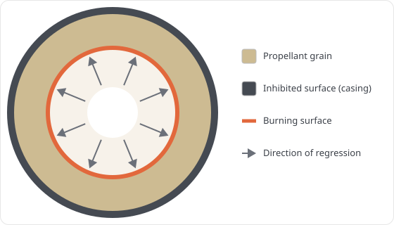
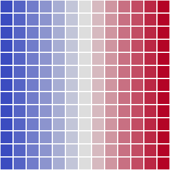
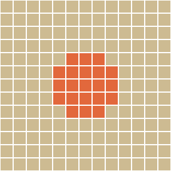

# 4. Grain Regression Analysis

The thrust a solid motor makes at any instant is set by how much propellant surface is burning. As the grain burns back, that burning area changes, and the chamber pressure and thrust follow it. So to predict a thrust curve, Machwave has to know the burning area, and along with it the port area, the free chamber volume, and the grain's mass properties, as a function of how far the surface has receded into the web. That recession depth is the **web distance** `w`, and working these quantities out across the burn is what we call regression analysis.

For a plain tubular (BATES) grain this is easy: the burning surface is a cylinder that grows outward, so the burn area is a textbook function of `w`. Most grains worth designing are not that simple. A star, a finocyl, a wagon wheel, or any port cut to shape a particular thrust profile has a burning surface with no closed-form area. Machwave handles these with the **fast marching method** (FMM).

The idea rests on Piobert's law: a burning surface recedes perpendicular to itself at the local burn rate. Picture the flame as a wavefront sweeping into the propellant. Rather than redraw the grain at every time step, FMM asks one question up front: for every point in the propellant, how far must the surface regress before the flame reaches it? Storing that answer for every point gives a **regression map**. A point deep in a thick web holds a large value; a point right at the port holds nearly zero.



*The burning surface starts at the port and regresses outward through the propellant, staying perpendicular to itself, until it reaches the inhibited casing. FMM records, for every point, the web distance at which the front arrives.*

That one map is all you need. The grain after burning a web `w` is simply every point whose value still exceeds `w`, since everything closer to the surface has already burned. The burning surface at that instant is the set of points whose value equals `w`. Once the map exists, burn area, port area, remaining volume, and mass properties at any `w` are cheap lookups instead of a fresh geometry calculation. It behaves like a topographic map of "depth into the propellant": flood it to level `w`, and the shoreline is the flame front.

Building the map is a distance calculation. Because the front advances at unit speed, one unit of web per unit of regression, the value $\phi$ at each point obeys the eikonal equation

$$
\lvert \nabla \phi \rvert = 1, \qquad \phi = 0 \text{ on the burning surface}
$$

which just says $\phi$ is the distance from the initial burning surface. This is the grassfire picture: light the edge of a dry field and the fire line spreads outward at a steady rate, so the time it reaches any spot is its distance from the line. Here the fire is the real flame front, and $\phi$ is the web it has to burn through to reach each point. The `skfmm.distance` solver fills the whole grid in one pass; Machwave builds the map once, caches it, and from then on each step only thresholds it.

!!! note "Where else this equation shows up"
    The eikonal equation gives the first-arrival time of any wavefront moving at a known speed. It is named for geometric optics (from the Greek *eikon*, image), where it traces light through a lens, and it underlies seismic travel-time tomography, sonar, and ultrasound timing. When the speed is uniform the arrival time is simply distance, which is why the fast marching method also powers robot path planning around obstacles, distance transforms in image processing, and the signed-distance fields used in computer graphics.

## 4.1 Step by Step

The clearest way to see this is to watch it happen on a tiny grain: a generic round bore on a deliberately coarse 13-by-13 grid, small enough that every array fits on the page. Each step shows the actual array Machwave builds next to a colored picture of it. The methods named are those of [`FMMGrainSegment2D`][machwave.models.grain.fmm._2d.FMMGrainSegment2D]; the 3D case differs only as noted in section 4.2.

**Lay down the grid: [`get_maps()`][machwave.models.grain.fmm._2d.FMMGrainSegment2D.get_maps].**
Each cell is given a position `(x, y)` as a fraction of the grain radius, so the casing wall sits at radius 1. The two maps are just the axis broadcast over the grid:

```
x by column:  -1.00 -0.83 -0.67 -0.50 -0.33 -0.17  0.00  0.17  0.33  0.50  0.67  0.83  1.00
y by row:     -1.00 -0.83 -0.67 -0.50 -0.33 -0.17  0.00  0.17  0.33  0.50  0.67  0.83  1.00
```




Every later step works from each cell's distance from the center, $\sqrt{x^2 + y^2}$.

**Find the propellant: [`get_mask()`][machwave.models.grain.fmm._2d.FMMGrainSegment2D.get_mask].**
A `1` marks a cell outside the casing wall ($x^2 + y^2 > 1$); the `0` cells are propellant.

```
 1  1  1  1  1  1  0  1  1  1  1  1  1
 1  1  1  0  0  0  0  0  0  0  1  1  1
 1  1  0  0  0  0  0  0  0  0  0  1  1
 1  0  0  0  0  0  0  0  0  0  0  0  1
 1  0  0  0  0  0  0  0  0  0  0  0  1
 1  0  0  0  0  0  0  0  0  0  0  0  1
 0  0  0  0  0  0  0  0  0  0  0  0  0
 1  0  0  0  0  0  0  0  0  0  0  0  1
 1  0  0  0  0  0  0  0  0  0  0  0  1
 1  0  0  0  0  0  0  0  0  0  0  0  1
 1  1  0  0  0  0  0  0  0  0  0  1  1
 1  1  1  0  0  0  0  0  0  0  1  1  1
 1  1  1  1  1  1  0  1  1  1  1  1  1
```


**Carve the port: [`get_initial_face_map()`][machwave.models.grain.fmm.base.FMMGrainSegment.get_initial_face_map].**
Each grain geometry draws its own port shape here; this example uses a round bore. Cells on the burning surface are `0`, solid propellant is `1`.

```
 1  1  1  1  1  1  1  1  1  1  1  1  1
 1  1  1  1  1  1  1  1  1  1  1  1  1
 1  1  1  1  1  1  1  1  1  1  1  1  1
 1  1  1  1  1  1  1  1  1  1  1  1  1
 1  1  1  1  1  0  0  0  1  1  1  1  1
 1  1  1  1  0  0  0  0  0  1  1  1  1
 1  1  1  1  0  0  0  0  0  1  1  1  1
 1  1  1  1  0  0  0  0  0  1  1  1  1
 1  1  1  1  1  0  0  0  1  1  1  1  1
 1  1  1  1  1  1  1  1  1  1  1  1  1
 1  1  1  1  1  1  1  1  1  1  1  1  1
 1  1  1  1  1  1  1  1  1  1  1  1  1
 1  1  1  1  1  1  1  1  1  1  1  1  1
```



**Apply the inhibitors: [`get_masked_face()`][machwave.models.grain.fmm.base.FMMGrainSegment.get_masked_face].**
Combine the port with the casing, then decide which surfaces are allowed to burn (`_apply_inhibition`). An inhibited inner surface stops the bore from burning, inhibited ends protect the end faces in 3D, and an uninhibited outer surface lets the wall burn inward. The grain here is case-bonded (outer surface inhibited, the default), so only the bore burns; the dots are outside the casing.

```
 ·  ·  ·  ·  ·  ·  1  ·  ·  ·  ·  ·  ·
 ·  ·  ·  1  1  1  1  1  1  1  ·  ·  ·
 ·  ·  1  1  1  1  1  1  1  1  1  ·  ·
 ·  1  1  1  1  1  1  1  1  1  1  1  ·
 ·  1  1  1  1  0  0  0  1  1  1  1  ·
 ·  1  1  1  0  0  0  0  0  1  1  1  ·
 1  1  1  1  0  0  0  0  0  1  1  1  1
 ·  1  1  1  0  0  0  0  0  1  1  1  ·
 ·  1  1  1  1  0  0  0  1  1  1  1  ·
 ·  1  1  1  1  1  1  1  1  1  1  1  ·
 ·  ·  1  1  1  1  1  1  1  1  1  ·  ·
 ·  ·  ·  1  1  1  1  1  1  1  ·  ·  ·
 ·  ·  ·  ·  ·  ·  1  ·  ·  ·  ·  ·  ·
```


**Build the map: [`get_regression_map()`][machwave.models.grain.fmm.base.FMMGrainSegment.get_regression_map].**
Now the fast marching method runs. `skfmm.distance` fills every propellant cell with its distance from the burning surface, as a fraction of the grain radius. This is the map the whole analysis hangs on: its largest value is the web thickness (here `0.270 m`, via [`get_web_thickness()`][machwave.models.grain.fmm.base.FMMGrainSegment.get_web_thickness]).

```
  ·   ·   ·   ·   ·   · 0.5   ·   ·   ·   ·   ·   ·
  ·   ·   · 0.5 0.4 0.4 0.4 0.4 0.4 0.5   ·   ·   ·
  ·   · 0.5 0.4 0.3 0.2 0.2 0.2 0.3 0.4 0.5   ·   ·
  · 0.5 0.4 0.3 0.2 0.1 0.1 0.1 0.2 0.3 0.4 0.5   ·
  · 0.4 0.3 0.2 0.1 0.0 0.0 0.0 0.1 0.2 0.3 0.4   ·
  · 0.4 0.2 0.1 0.0 0.0 0.0 0.0 0.0 0.1 0.2 0.4   ·
0.5 0.4 0.2 0.1 0.0 0.0 0.0 0.0 0.0 0.1 0.2 0.4 0.5
  · 0.4 0.2 0.1 0.0 0.0 0.0 0.0 0.0 0.1 0.2 0.4   ·
  · 0.4 0.3 0.2 0.1 0.0 0.0 0.0 0.1 0.2 0.3 0.4   ·
  · 0.5 0.4 0.3 0.2 0.1 0.1 0.1 0.2 0.3 0.4 0.5   ·
  ·   · 0.5 0.4 0.3 0.2 0.2 0.2 0.3 0.4 0.5   ·   ·
  ·   ·   · 0.5 0.4 0.4 0.4 0.4 0.4 0.5   ·   ·   ·
  ·   ·   ·   ·   ·   · 0.5   ·   ·   ·   ·   ·   ·
```


*Bright cells sit on the burning surface; the color darkens with depth into the web, so the gradient is the order in which the propellant burns.*

**Read the grain at a web distance: [`get_face_map(w)`][machwave.models.grain.fmm.base.FMMGrainSegment.get_face_map].**
To see the grain after it has burned a web `w`, keep the cells whose map value still exceeds `w`. Here `w = 0.094 m` (0.19 in radius units), so the cells at the `0.1` level have burned and the `0.2` level and beyond remain. `1` is solid, `0` has burned away, the dots are outside.

```
 ·  ·  ·  ·  ·  ·  1  ·  ·  ·  ·  ·  ·
 ·  ·  ·  1  1  1  1  1  1  1  ·  ·  ·
 ·  ·  1  1  1  1  1  1  1  1  1  ·  ·
 ·  1  1  1  0  0  0  0  0  1  1  1  ·
 ·  1  1  0  0  0  0  0  0  0  1  1  ·
 ·  1  1  0  0  0  0  0  0  0  1  1  ·
 1  1  1  0  0  0  0  0  0  0  1  1  1
 ·  1  1  0  0  0  0  0  0  0  1  1  ·
 ·  1  1  0  0  0  0  0  0  0  1  1  ·
 ·  1  1  1  0  0  0  0  0  1  1  1  ·
 ·  ·  1  1  1  1  1  1  1  1  1  ·  ·
 ·  ·  ·  1  1  1  1  1  1  1  ·  ·  ·
 ·  ·  ·  ·  ·  ·  1  ·  ·  ·  ·  ·  ·
```


**Trace the front: [`get_contours(w)`][machwave.models.grain.fmm._2d.FMMGrainSegment2D.get_contours].**
The flame front is the boundary between the solid and burned cells above. It is traced as a curve (one closed loop of 29 points here, in `(row, col)`) by `get_contours` in `machwave.models.grain.fmm.contours`; `get_length` from that module sums the curve into the burning perimeter, dropping any stretch that lies on the casing wall.

```
(9.0, 8.2) (8.2, 9.0) (8.0, 9.1) (7.0, 9.6) (6.0, 9.6) (5.0, 9.6) ...
... (6.0, 2.4) (7.0, 2.4) (8.0, 2.9) (9.0, 3.8) (9.6, 5.0) (9.6, 6.0) ... (closed)
```


From the regressed grid Machwave reads everything the ballistics solver needs: the burning and port areas ([`get_burn_area`][machwave.models.grain.fmm._2d.FMMGrainSegment2D.get_burn_area], [`get_port_area`][machwave.models.grain.fmm._2d.FMMGrainSegment2D.get_port_area]), the remaining volume, and the center of gravity and inertia tensor ([`get_center_of_gravity`][machwave.models.grain.fmm._2d.FMMGrainSegment2D.get_center_of_gravity], [`get_moment_of_inertia`][machwave.models.grain.fmm._2d.FMMGrainSegment2D.get_moment_of_inertia]). Repeating the threshold at each web distance traces these out across the whole burn.

## 4.2 Constant vs Varying Cross-Section

Many grains keep the same cross-section all the way down the tube, a port simply extruded along the length. One 2D slice then describes the whole grain, which is what [`FMMGrainSegment2D`][machwave.models.grain.fmm._2d.FMMGrainSegment2D] does: the burn area is the burning perimeter times the current length, plus any exposed end faces. When the port changes along the length, a finocyl whose fins cover only part of the span, or a cone, one slice is not enough, and [`FMMGrainSegment3D`][machwave.models.grain.fmm._3d.FMMGrainSegment3D] solves the same map over the full volume. The differences, step by step:

- **Grid.** `get_maps` adds a `map_z` axis, so each array gains a leading slice index over `L = floor(map_dim * length / outer_diameter)` slices (`get_normalized_length`, required `>= 3`). The port may change along the length, and the two end layers are opened so the end faces burn.
- **Inhibitors.** Both can inhibit the inner surface; 3D additionally protects the end faces when an end is inhibited.
- **The map.** 2D solves with one isotropic cell spacing; 3D uses anisotropic spacing `[axial, radial, radial]`, because the voxel grid is taller along the axis than it is wide across the radius.
- **Front and port area.** 2D traces the whole slice and reads a single port area; 3D works one slice at a time, taking an axial index in `get_contours(w, z)` and [`get_port_area(w, z)`][machwave.models.grain.fmm._3d.FMMGrainSegment3D.get_port_area].
- **Burn area.** 2D extrudes the burning perimeter over the length and adds the exposed end faces. 3D measures the burning surface directly, as a marching-cubes mesh of the regression iso-surface ([`get_burn_area_interp_func`][machwave.models.grain.fmm._3d.FMMGrainSegment3D.get_burn_area_interp_func]), which captures the port walls and the end faces together.
- **Volume.** 2D is length times face area; 3D counts the solid voxels and multiplies by the voxel volume (`get_volume_per_element`).
- **Mass properties.** 2D works from the single cross-section, placing it along the axis and adding a uniform-rod term for the length; 3D feeds the real voxel cloud straight to the inertia routines ([`get_center_of_gravity`][machwave.models.grain.fmm._3d.FMMGrainSegment3D.get_center_of_gravity], [`get_moment_of_inertia`][machwave.models.grain.fmm._3d.FMMGrainSegment3D.get_moment_of_inertia]).

# References

1. Sethian, J. A. (1999). *Level Set Methods and Fast Marching Methods* (2nd ed.). Cambridge University Press.
2. Lorensen, W. E., & Cline, H. E. (1987). *Marching Cubes: A High Resolution 3D Surface Construction Algorithm*. ACM SIGGRAPH Computer Graphics, 21(4), 163-169.
</content>
