# 4. Grain Regression

The thrust generated by a solid motor or hybrid engine depends on how much propellant surface is burning.
As the propellant burns, combustion products are released (mostly in gaseous form) and the grain recedes.
The burn direction is always perpendicular to the uninhibited surface (Piobert's Law), so the shape of that surface determines how much area is burning at any moment.
Determining the shape of the burning surface as a function of how far it has receded is called regression analysis.

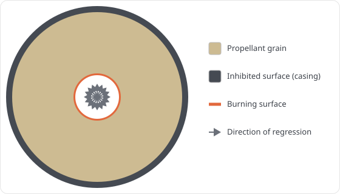

For a tubular or BATES geometry, the burn area can be easily determined analytically as a function of the web distance traveled.
However, for more complex geometries, the burn area may need to be determined through numerical methods.


Machwave uses the fast marching method (FMM) to compute the burn area for complex grain geometries.
The FMM is a numerical algorithm for solving the Eikonal equation, which describes the evolution of a wavefront as it propagates through a medium.
In the context of grain regression analysis, the wavefront represents the burning surface of the propellant, and the medium is the solid grain.

In short, Machwave builds a map of the grain with matrices (depending on the geometry).
Each cell in the map represents either a 1. point in the propellant; 2. a point outside the outer diameter; or 3. an empty point.
The burn surface is defined by the boundary between 1 and 3.
The number of cells in the map is determined by the grid resolution. A higher grid resolution means a more accurate representation of the grain, but longer computation time.

The FMM algorithm then picks up this map and calculates the distance from the initial burning surface(s) to every point in the propellant grain.
The result is a single regression map, that can be used to determine the perimeter of the burning surface at any web distance.

Machwave currently supports both 2D and 3D FMM regression, for constant and varying cross-section grain geometries.

Section 4.1 walks through the 2D FMM implementation step by step, showing the arrays and visualizations at each stage. Section 4.2 shows the differences between the 2D and 3D implementations, and how Machwave handles varying cross-section geometries. Section 4.3 maps the full call flow for both.

## 4.1 Step by Step

This section walks through a single tubular grain regression with a grid resolution of `n=13`, but the same steps apply to any other geometry.
The map is kept this small for documentation only, real simulations have a lower limit of `n=100`.

**Generate the coordinate grids: [`get_coordinate_grids()`][machwave.models.grain.fmm._2d.FMMGrainSegment2D.get_coordinate_grids].**
Each cell is given a position `(x, y)` as a fraction of the grain radius, so the outer diameter sits at radius 1. The two grids are just the axis values broadcast across the cross-section:

```
x by column:  -1.00 -0.83 -0.67 -0.50 -0.33 -0.17  0.00  0.17  0.33  0.50  0.67  0.83  1.00
y by row:     -1.00 -0.83 -0.67 -0.50 -0.33 -0.17  0.00  0.17  0.33  0.50  0.67  0.83  1.00
```


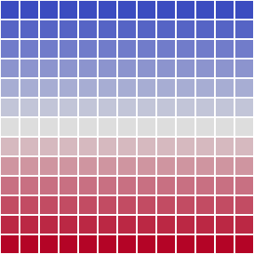

**Mask the outer diameter: [`get_outer_diameter_mask()`][machwave.models.grain.fmm._2d.FMMGrainSegment2D.get_outer_diameter_mask].**
A `1` marks a cell outside the outer diameter ($x^2 + y^2 > 1$); the `0` cells are propellant.

```
 1  1  1  1  1  1  0  1  1  1  1  1  1
 1  1  1  0  0  0  0  0  0  0  1  1  1
 1  1  0  0  0  0  0  0  0  0  0  1  1
 1  0  0  0  0  0  0  0  0  0  0  0  1
 1  0  0  0  0  0  0  0  0  0  0  0  1
 1  0  0  0  0  0  0  0  0  0  0  0  1
 0  0  0  0  0  0  0  0  0  0  0  0  0
 1  0  0  0  0  0  0  0  0  0  0  0  1
 1  0  0  0  0  0  0  0  0  0  0  0  1
 1  0  0  0  0  0  0  0  0  0  0  0  1
 1  1  0  0  0  0  0  0  0  0  0  1  1
 1  1  1  0  0  0  0  0  0  0  1  1  1
 1  1  1  1  1  1  0  1  1  1  1  1  1
```

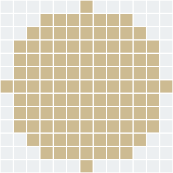

**Carve the core: [`generate_initial_face_map()`][machwave.models.grain.fmm.base.FMMGrainSegment.generate_initial_face_map].**
Each grain geometry draws its own shape here.
This example uses a circular core. Empty cells are `0`, solid propellant is `1`.

```
 1  1  1  1  1  1  1  1  1  1  1  1  1
 1  1  1  1  1  1  1  1  1  1  1  1  1
 1  1  1  1  1  1  1  1  1  1  1  1  1
 1  1  1  1  1  1  1  1  1  1  1  1  1
 1  1  1  1  1  0  0  0  1  1  1  1  1
 1  1  1  1  0  0  0  0  0  1  1  1  1
 1  1  1  1  0  0  0  0  0  1  1  1  1
 1  1  1  1  0  0  0  0  0  1  1  1  1
 1  1  1  1  1  0  0  0  1  1  1  1  1
 1  1  1  1  1  1  1  1  1  1  1  1  1
 1  1  1  1  1  1  1  1  1  1  1  1  1
 1  1  1  1  1  1  1  1  1  1  1  1  1
 1  1  1  1  1  1  1  1  1  1  1  1  1
```


**Apply the inhibitors: [`get_masked_face()`][machwave.models.grain.fmm.base.FMMGrainSegment.get_masked_face].**
Lays the initial face over the outer-diameter mask, then `_apply_surface_inhibition` decides which of the grain's four surfaces are allowed to burn (an inhibited surface cannot burn).
By default only the outer surface is inhibited.

| Surface | Default | 2D | 3D |
|---|---|---|---|
| Outer | inhibited | ring inside the wall opens if uninhibited | same |
| Core | burns | core cells masked if inhibited | core masked slice by slice |
| End faces | burn | modeled by the grain length shrinking as they regress | first and last slices filled with zeros to expose them |

```
 ·  ·  ·  ·  ·  ·  1  ·  ·  ·  ·  ·  ·
 ·  ·  ·  1  1  1  1  1  1  1  ·  ·  ·
 ·  ·  1  1  1  1  1  1  1  1  1  ·  ·
 ·  1  1  1  1  1  1  1  1  1  1  1  ·
 ·  1  1  1  1  0  0  0  1  1  1  1  ·
 ·  1  1  1  0  0  0  0  0  1  1  1  ·
 1  1  1  1  0  0  0  0  0  1  1  1  1
 ·  1  1  1  0  0  0  0  0  1  1  1  ·
 ·  1  1  1  1  0  0  0  1  1  1  1  ·
 ·  1  1  1  1  1  1  1  1  1  1  1  ·
 ·  ·  1  1  1  1  1  1  1  1  1  ·  ·
 ·  ·  ·  1  1  1  1  1  1  1  ·  ·  ·
 ·  ·  ·  ·  ·  ·  1  ·  ·  ·  ·  ·  ·
```

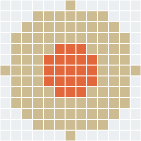

**Compute the regression map: [`get_regression_map()`][machwave.models.grain.fmm.base.FMMGrainSegment.get_regression_map].**
Now the fast marching method runs. `skfmm.distance` fills every propellant cell with its distance from the burning surface, as a fraction of the grain radius. The map's largest value is the web thickness ([`get_web_thickness()`][machwave.models.grain.fmm.base.FMMGrainSegment.get_web_thickness]).

```
  ·   ·   ·   ·   ·   · 0.5   ·   ·   ·   ·   ·   ·
  ·   ·   · 0.5 0.4 0.4 0.4 0.4 0.4 0.5   ·   ·   ·
  ·   · 0.5 0.4 0.3 0.2 0.2 0.2 0.3 0.4 0.5   ·   ·
  · 0.5 0.4 0.3 0.2 0.1 0.1 0.1 0.2 0.3 0.4 0.5   ·
  · 0.4 0.3 0.2 0.1 0.0 0.0 0.0 0.1 0.2 0.3 0.4   ·
  · 0.4 0.2 0.1 0.0 0.0 0.0 0.0 0.0 0.1 0.2 0.4   ·
0.5 0.4 0.2 0.1 0.0 0.0 0.0 0.0 0.0 0.1 0.2 0.4 0.5
  · 0.4 0.2 0.1 0.0 0.0 0.0 0.0 0.0 0.1 0.2 0.4   ·
  · 0.4 0.3 0.2 0.1 0.0 0.0 0.0 0.1 0.2 0.3 0.4   ·
  · 0.5 0.4 0.3 0.2 0.1 0.1 0.1 0.2 0.3 0.4 0.5   ·
  ·   · 0.5 0.4 0.3 0.2 0.2 0.2 0.3 0.4 0.5   ·   ·
  ·   ·   · 0.5 0.4 0.4 0.4 0.4 0.4 0.5   ·   ·   ·
  ·   ·   ·   ·   ·   · 0.5   ·   ·   ·   ·   ·   ·
```

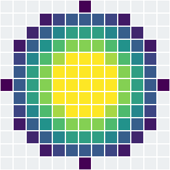

*Yellow cells represent empty space. The color darkens with depth into the web.*

**Grain map at a web distance: [`get_face_map(w)`][machwave.models.grain.fmm.base.FMMGrainSegment.get_face_map].**
The face map at a web distance is obtained by thresholding the regression map at that web distance. `1` is solid propellant, `0` has burned away, and the dots are outside the casing. Example at `w=0.2`:

```
 ·  ·  ·  ·  ·  ·  1  ·  ·  ·  ·  ·  ·
 ·  ·  ·  1  1  1  1  1  1  1  ·  ·  ·
 ·  ·  1  1  1  1  1  1  1  1  1  ·  ·
 ·  1  1  1  0  0  0  0  0  1  1  1  ·
 ·  1  1  0  0  0  0  0  0  0  1  1  ·
 ·  1  1  0  0  0  0  0  0  0  1  1  ·
 1  1  1  0  0  0  0  0  0  0  1  1  1
 ·  1  1  0  0  0  0  0  0  0  1  1  ·
 ·  1  1  0  0  0  0  0  0  0  1  1  ·
 ·  1  1  1  0  0  0  0  0  1  1  1  ·
 ·  ·  1  1  1  1  1  1  1  1  1  ·  ·
 ·  ·  ·  1  1  1  1  1  1  1  ·  ·  ·
 ·  ·  ·  ·  ·  ·  1  ·  ·  ·  ·  ·  ·
```

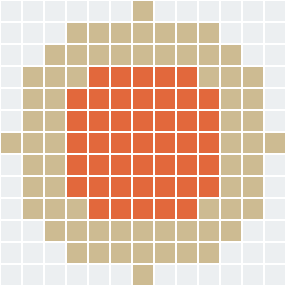

The mass-property reads, volume in 3D plus the center of gravity and moment of inertia in both 2D and 3D, need only the solid (`1`) cells of this map. They take those as a plain boolean mask from `_get_solid_mask`, cheaper to build and store than the masked integer map, which together with the solid-cell indices it feeds is cached per web distance. Several of these reads share one web distance on a single timestep, so the regression map is thresholded once and every consumer reuses the result. The web distance only grows over a burn, so a single-entry cache is enough.

**Contour the burn front: [`get_contours(w)`][machwave.models.grain.fmm._2d.FMMGrainSegment2D.get_contours].**
A closed-loop curve is traced by `get_iso_contours` in `machwave.models.grain.fmm.contours`, for a given web distance.
Then, `get_length` sums the curve to calculate the burning perimeter, discounting any stretch that lies on the casing wall.

```
(9.0, 8.2) (8.2, 9.0) (8.0, 9.1) (7.0, 9.6) (6.0, 9.6) (5.0, 9.6) ...
... (6.0, 2.4) (7.0, 2.4) (8.0, 2.9) (9.0, 3.8) (9.6, 5.0) (9.6, 6.0) ... (closed)
```

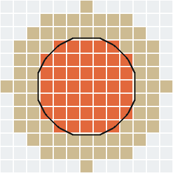

**Burn area across the web: [`get_burn_area(w)`][machwave.models.grain.fmm._2d.FMMGrainSegment2D.get_burn_area].**
The contour gives the burning perimeter at a single web distance.
The burn area is that perimeter times the current grain length, plus any uninhibited end faces.
At each web step Machwave contours the front and evaluates that burn area, building the burn area as a function of web. The curve is then smoothed with a Savitzky-Golay filter (`smooth_savitzky_golay` in `machwave.core.filters`).

The burn area curve is interpolated with `scipy`'s `interp1d` by [`get_burn_area_interpolator`][machwave.models.grain.fmm._2d.FMMGrainSegment2D.get_burn_area_interpolator] and then cached. So `get_burn_area(w)` does not run the FMM at all, just a quick lookup and interpolation.

**Volume: [`get_volume(w)`][machwave.models.grain.fmm._2d.FMMGrainSegment2D.get_volume].**
The volume is the current grain length times the face area, reusing the same cached, smoothed face-area curve that feeds the port area, so it adds no work of its own.

**Port area: [`get_port_area(w)`][machwave.models.grain.fmm._2d.FMMGrainSegment2D.get_port_area].**
The port is the empty space inside the casing: the casing cross-section minus the solid face area. It comes straight from the cached face area, so it needs no extra work.

## 4.2 2D vs 3D FMM

[`FMMGrainSegment2D`][machwave.models.grain.fmm._2d.FMMGrainSegment2D] describes a grain by a single cross-section extruded along its length.
[`FMMGrainSegment3D`][machwave.models.grain.fmm._3d.FMMGrainSegment3D] adds a `z` axis to the maps, split into `get_axial_resolution()` slices, so each slice can carve its own core, needed for varying geometries like finocyl or conical grains.
The FMM runs once over the full volume.
Since the slice count is rounded to an integer, `_compute_regression_distance` passes a per-axis grid spacing (`dx=[axial_grid_spacing, radial_grid_spacing, radial_grid_spacing]`) so distances stay consistent along `z` and across the cross-section.

The regression map is generated differently for 2D and 3D. 2D traces a perimeter with marching squares ([`get_contours`][machwave.models.grain.fmm._2d.FMMGrainSegment2D.get_contours], using `skimage`'s `find_contours`). 3D meshes a surface with marching cubes ([`get_burn_area_interpolator`][machwave.models.grain.fmm._3d.FMMGrainSegment3D.get_burn_area_interpolator], `skimage`'s `marching_cubes`) and takes its area directly.

For volume, 3D FMM counts the solid voxels in the cached solid mask and multiplies by the volume of one voxel. The center of gravity and moment of inertia read the same cached mask and its solid-cell indices, so the per-timestep mass properties all share a single threshold of the regression map instead of rebuilding it for each read.

Since the port area in 3D varies along the grain, [`get_port_area(w, z)`][machwave.models.grain.fmm._3d.FMMGrainSegment3D.get_port_area] slices the cross-section at axial height `z` and subtracts the solid area from the outer diameter exterior.

## 4.3 Call Flow

The setup pipeline is shared by both implementations. They diverge only at how the burn area is measured and how volume and port area are read back. Methods marked `*` are overridden in 3D: `get_coordinate_grids` adds a `z` axis, `_apply_surface_inhibition` works slice by slice, and `_compute_regression_distance` uses a per-axis grid spacing.

**Shared setup — `FMMGrainSegment`**

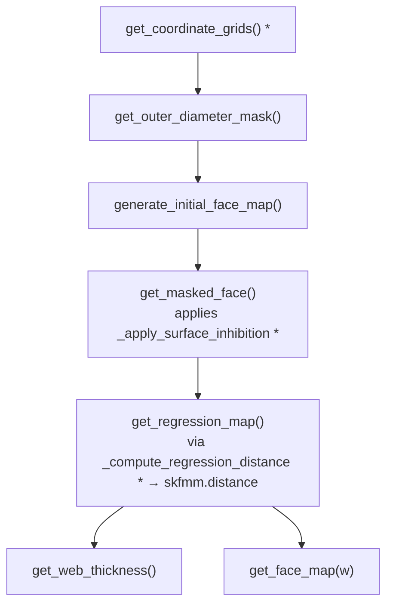

**2D outputs — `FMMGrainSegment2D`**

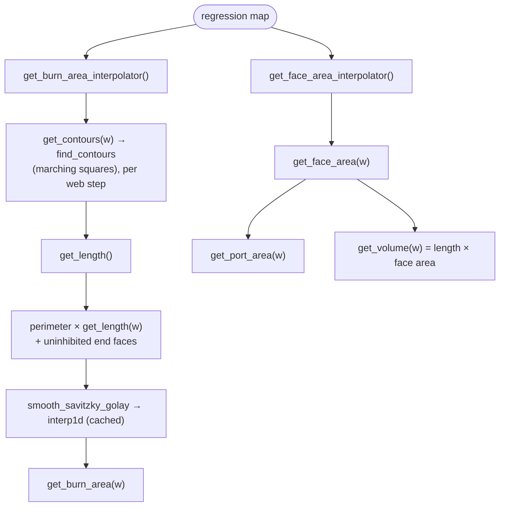

**3D outputs — `FMMGrainSegment3D`**

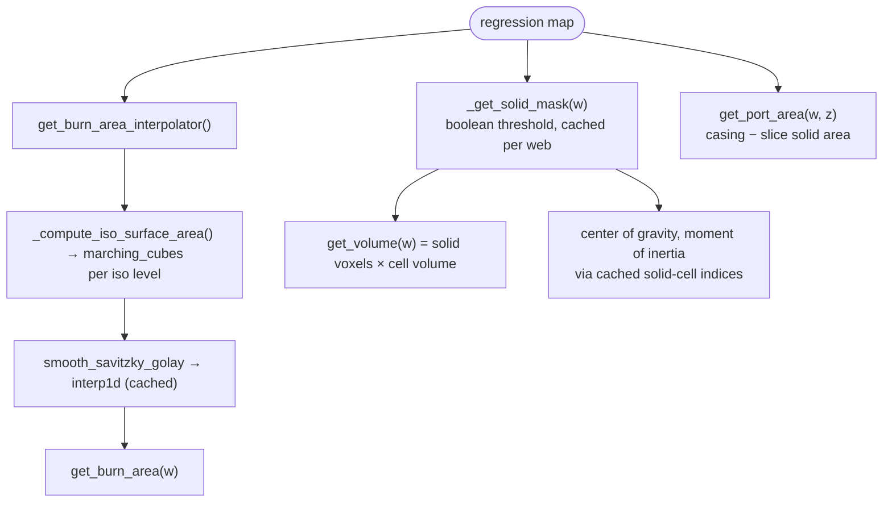

# References

1. Sethian, J. A. (1999). *Level Set Methods and Fast Marching Methods* (2nd ed.). Cambridge University Press.
2. Lorensen, W. E., & Cline, H. E. (1987). *Marching Cubes: A High Resolution 3D Surface Construction Algorithm*. ACM SIGGRAPH Computer Graphics, 21(4), 163-169.
</content>
